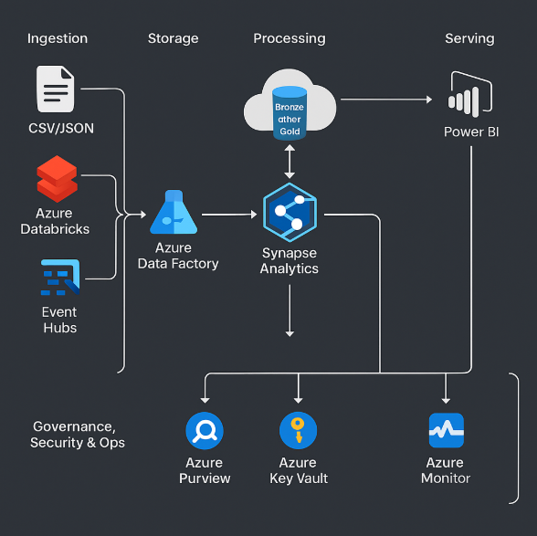

# Enterprise Data Warehouse and Analytics Platform for MediCare Analytics

## Project Overview

**MediCare Analytics** is a fictional healthcare organization managing patient records, treatment histories, and operational hospital data across a distributed network. This project focuses on designing and implementing a modern, Azure-based enterprise data warehouse to centralize disparate datasets, enable historical and real-time analytics, and ensure regulatory compliance in healthcare data management.

---

## Objectives

- Design and deploy an OLAP data warehouse using **Azure Synapse Analytics**.
- Develop scalable **batch and real-time ingestion pipelines** with **ADF** and **Databricks**.
- Build a hybrid **Star Schema** and **Data Vault 2.0** model for analytics and auditability.
- Integrate **Great Expectations** and **Purview** for data validation and governance.
- Deliver **Power BI dashboards** with real-time metrics from Synapse.
- Automate infrastructure and pipelines using **Terraform** and **Azure DevOps**.

---

## Architecture Overview

This architecture supports batch, streaming, and structured/semi-structured data ingestion through a layered data lake (Bronze → Silver → Gold), optimized for analytical queries and compliance.

---

## Tools & Technologies

| Category               | Tools/Services Used                                                                 |
|------------------------|--------------------------------------------------------------------------------------|
| Cloud & Storage        | Azure Data Lake Gen2, Azure Blob Storage                                            |
| Orchestration & ETL    | Azure Data Factory, Azure Databricks, Event Hubs                                    |
| Data Warehouse         | Azure Synapse Analytics (Dedicated SQL + Serverless SQL Pools)                      |
| Governance & Security  | Azure Purview, Azure Key Vault, Dynamic Data Masking                                |
| Monitoring & Ops       | Azure Monitor, Log Analytics, Great Expectations, Azure DevOps                      |
| Reporting & BI         | Power BI (DirectQuery + Real-Time Dashboards)                                       |
| Infrastructure as Code | Terraform, YAML pipelines                                                           |

---

## Repository Structure

medicare-data-warehouse/
│
├── README.md                      # Executive summary + navigation to detailed docs
├── architecture/
│   └── architecture-diagram.png  # High-level architecture image
│
├── data-modeling/
│   ├── star-schema.png
│   └── data-vault-diagram.png
│
├── notebooks/
│   ├── bronze_layer_etl.ipynb
│   ├── silver_cleaning.ipynb
│   └── gold_fact_tables.ipynb
│
├── pipelines/
│   └── adf_pipeline_json/        # Exported ADF pipelines as JSON
│
├── sql/
│   ├── create_fact_tables.sql
│   ├── materialized_views.sql
│   └── optimization_queries.sql
│
├── powerbi/
│   └── dashboard_screenshots/
│
├── infrastructure/
│   ├── terraform/
│   └── azure-devops-pipelines/
│
├── governance/
│   └── data-quality-framework.md
│
└── LICENSE

- End-to-end data engineering lifecycle coverage: ingestion, modeling, analytics, governance.
- Streaming analytics using Databricks and Azure Event Hubs.
- Scalable data lake architecture with Bronze/Silver/Gold layers using Delta Lake.
- Data quality enforcement using Great Expectations with CI/CD integration.
- Secure, governed analytics with row-level security and PII masking.

---

## Learnings & Impact

This project demonstrates the full lifecycle of enterprise-grade data platform development in the healthcare domain. It highlights my capabilities in:
- Designing cloud-native data architectures
- Building robust, scalable pipelines
- Applying best practices for data quality, governance, and observability
- Automating infrastructure and deployments in a DevOps-first culture
